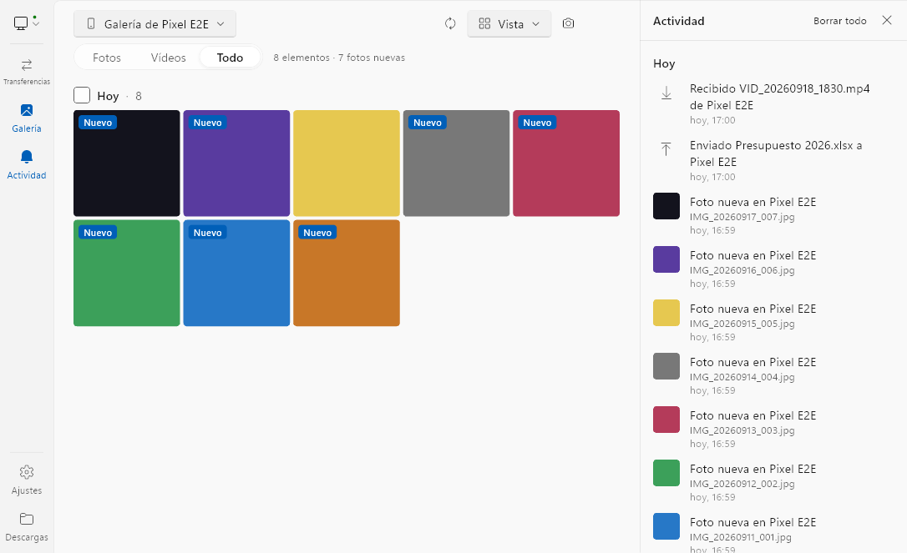
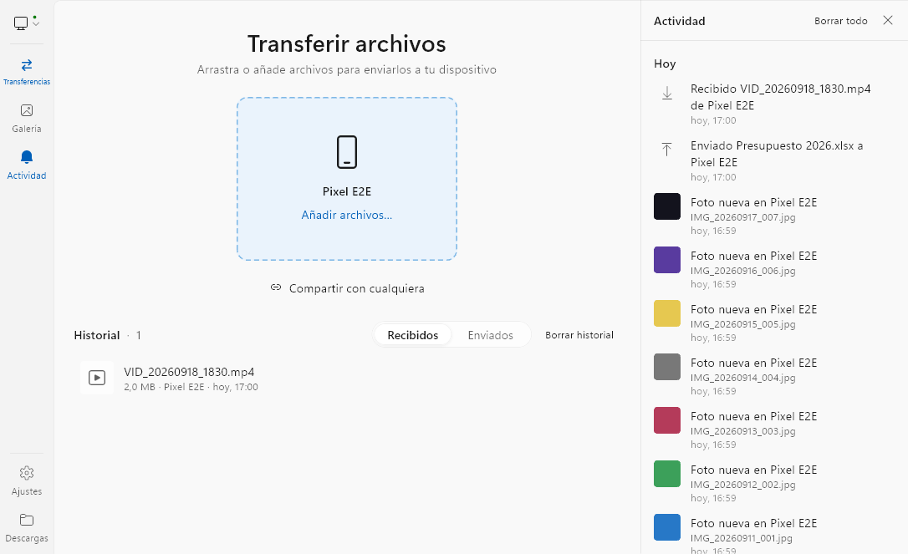
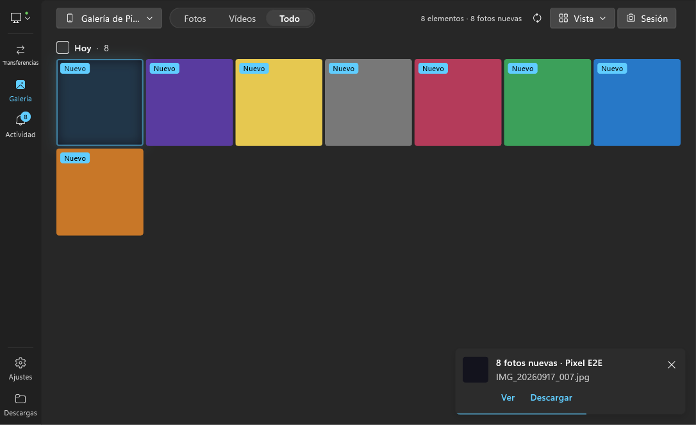
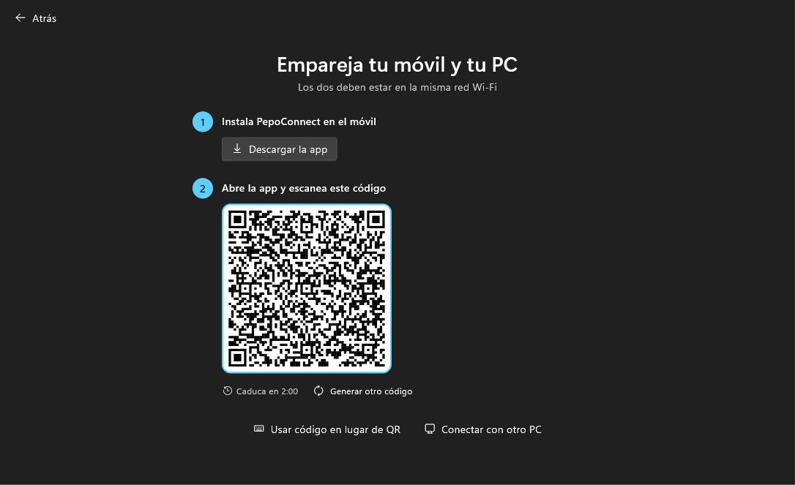
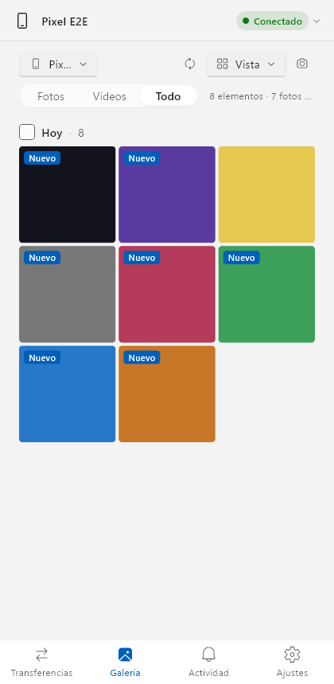

# PepoConnect

Fotos y archivos entre el móvil y el PC, al instante. Es la parte de archivos de
Intel Unison hecha de nuevo: haces una foto con el móvil, aparece en el PC en
menos de dos segundos, la previsualizas y decides si descargarla o no. Todo por
la red local, cifrado, sin cuentas y sin instalador.

Plataformas: Windows (`.exe` portable), Linux x64 y arm64 (tarball, AppImage y
Flatpak para móviles Linux), Android (`.apk`) e iOS (`.ipa`).

## Capturas

| Galería del móvil en el PC | Transferencias |
|---|---|
|  |  |

| Tema oscuro, fotos recién llegadas | Emparejar por QR | Ancho de móvil |
|---|---|---|
|  |  |  |

Las capturas las genera `flutter test integration_test/screenshots_test.dart -d windows`
a partir de la app real.

## Qué hace

- **Galería del móvil en el PC** con miniaturas, previsualización a 1600 px y
  descarga del original con sus metadatos. Las fotos nuevas aparecen arriba con
  un aviso y un toast con "Ver" y "Descargar" (una ráfaga de fotos se agrupa en
  un solo aviso); "Seleccionar nuevas" (Ctrl+Mayús+N) las deja listas para
  descargarlas de golpe.
- **Transferencias en los dos sentidos**: arrastra archivos a la zona del
  dispositivo o elige "Añadir archivos…"; desde el móvil, el botón de enviar o
  "Compartir con PepoConnect". Reanudación tras cortes, verificación de
  integridad y varios archivos en paralelo.
- **Varios móviles a la vez** en el mismo PC, con lo recibido separado por
  dispositivo (`Fotos/`, `Vídeos/`, `Archivos/`) o unificado desde Ajustes.
- **Emparejamiento por QR** (móvil) o por código de 6 dígitos (PC↔PC), con
  reconexión automática.
- Extras: auto-descarga de fotos nuevas, conversión HEIC→JPEG en el móvil, modo
  sesión de fotos, portapapeles compartido y **envío por navegador** a
  cualquiera sin la app (enlace de un solo uso).

## Seguridad

Cada dispositivo genera una clave EC P-256 y un certificado autofirmado. Las
conexiones van por TLS 1.3 con el certificado del otro extremo anclado por
huella, y cada sesión se autentica con una clave compartida derivada durante
el emparejamiento (HKDF/HMAC-SHA256). No hay servidores externos.

## Compilar

Requisitos: Flutter 3.47 (estable), Visual Studio Build Tools con C++ y ATL
(Windows), Android SDK con NDK 28, Java 17, Rust (lanzador de Windows).

```bash
flutter pub get
flutter test                       # tests de la app
cd packages/pepo_core && dart test # tests del motor de red
```

Prueba de extremo a extremo real (la app completa y un "móvil" sin interfaz en el
mismo proceso, sobre TLS en loopback: emparejar por QR, foto nueva, descarga,
envíos en los dos sentidos):

```bash
flutter test integration_test/e2e_test.dart -d windows
```

| Plataforma | Comando |
|---|---|
| Windows (`.exe` único) | `flutter build windows --release` y `.\packaging\windows\build-portable.ps1` → `dist\PepoConnect-win-x64.exe` |
| Android | `flutter build apk --release --split-per-abi` (firma con `android/key.properties`, ver `key.properties.example`) |
| Linux | `flutter build linux --release` y `packaging/linux/make-tarball.sh x64`, `make-appimage.sh x64 x86_64`, `make-flatpak.sh x64 x86_64` |
| iOS | `flutter build ios --release --no-codesign` (el `.ipa` sin firmar se genera en CI) |

`.github/workflows/release.yml` compila las cinco plataformas al crear una
etiqueta `vX.Y.Z` (`tool/release.ps1 -Part patch`).

Segunda instancia en el mismo PC para probar: `flutter run -d windows --dart-entrypoint-args=--profile=dev2`.

## Instalar el `.ipa` en iPhone sin cuenta de desarrollador

1. Descarga `PepoConnect-ios-unsigned.ipa` del release.
2. Instálalo con Sideloadly (Windows) o AltStore con tu Apple ID.
3. Con Apple ID gratuito la app caduca cada 7 días (AltServer la renueva
   sola si está en la misma Wi-Fi) y puedes tener 3 apps así a la vez.
4. La primera vez, acepta el permiso de "Red local"; en iPhone las fotos
   llegan al PC mientras PepoConnect está en pantalla.

## Estructura

- `packages/pepo_core`: motor en Dart puro (identidad, protocolo, sesiones,
  transferencias, galería, servidor de invitados). Sin dependencias de Flutter.
- `lib/`: app Flutter (estado con Riverpod, shell Fluent, páginas, plataforma).
- `windows-launcher/`: lanzador Rust que empaqueta la app en un solo `.exe`.
- `packaging/`: scripts de empaquetado por plataforma.
